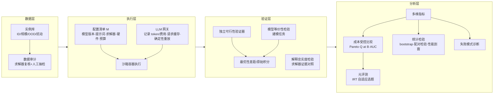

# 方向五：成本受控、可复现的 LLM 与 OR 评测体系 —— 研究方案

> 对应《LLM 与 OR 研究方向报告》（2026-09-10）第五节。
> 本文按组会板书要求组织：〈1〉问题定义（业务定义 / 数学定义）→〈2〉调研现状（AAAI、NeurIPS、arXiv 及 ABS 三星以上期刊，2023—2026，40+ 篇）→〈3〉要解决的问题 →〈4〉技术路线。
> 撰写日期：2026-10-08

---

## 〈1〉问题定义

### 1.1 业务定义

**一句话**：在**给定预算**（API 费用、token、算力、墙钟时间）下，用一套**可重放、可审计**的协议，同时衡量"LLM + 运筹优化"方法的**解质量、可行性、成本、稳定性与泛化**，从而回答"在同样的花费下，哪种方法真的更好"。

**评测对象**（被测系统，System Under Test, SUT）分三类：

| 类别 | 典型任务 | 代表方法 |
|---|---|---|
| A. 自然语言→优化建模 | 文字题 → LP/MILP 模型 + 求解代码 → 最优值 | OptiMUS、Chain-of-Experts、ORLM、SIRL、OptMATH |
| B. LLM 自动启发式/算法设计 | 生成 TSP/BPP/调度等问题的启发式代码 | FunSearch、EoH、ReEvo、MCTS-AHD、HSEvo |
| C. LLM 直接求解 / 搜索控制 | LLM 直接输出解，或控制元启发式 | OPRO、LLMs-can-Schedule、端到端 CO 求解器 |

**利益相关方与痛点**：

| 角色 | 需要回答的问题 | 当前痛点 |
|---|---|---|
| 研究者 | 我的方法是否真的优于基线？ | 只报最优目标值；运行一次；提示词不公开；不同论文用不同模型版本、时间上限、硬件 |
| 审稿人 / 期刊 | 结果能否复现？ | 闭源模型会更新、会下线；LLM 输出不确定；基准数据本身有错 |
| 企业用户 | 花多少钱换多少质量？能否上线？ | 看不到 token/API 费用和延迟；不知道换到更大规模、真实数据上表现如何 |
| 基准维护者 | 基准是否被"刷穿"或污染？ | 题目可能进了预训练语料；小规模题目区分度低 |

**业务目标**：构建一个评测平台 + 一组协议，输出**"质量—成本 Pareto 前沿"**、**"给定预算下的性能"**和**"可复现性报告"**，而不是单一排行榜分数。

### 1.2 数学定义

**(1) 任务、实例与分布**

- 任务族 $\mathcal{T}=\{t_1,\dots,t_K\}$（如 MILP 建模、TSP 启发式设计、柔性作业车间调度 FJSP）。
- 每个任务的实例分布 $\mathcal{D}_t$；评测集被划分为分布内 $S^{\text{ID}}_t$、规模外推 $S^{\text{scale}}_t$、分布外 $S^{\text{OOD}}_t$ 和抗污染扰动集 $S^{\text{pert}}_t$。
- 实例 $i$ 的优化问题：$\min_{x\in X_i} f_i(x)$，参考最优值（或最好已知值）记为 $f_i^\*$。

**(2) 被测方法的完整配置**

$$
M=(\theta,\ v,\ \pi,\ w,\ s,\ h,\ \mathbf{b})
$$

其中 $\theta$ 为 LLM，$v$ 为模型快照/版本，$\pi$ 为提示词与解码参数（温度、top-p、种子），$w$ 为智能体工作流，$s$ 为求解器及其版本与参数，$h$ 为硬件，$\mathbf{b}$ 为预算向量。**配置清单 $M$ 的哈希就是可复现性的最小单元**。

**(3) 单次运行的观测量**

对实例 $i$、随机性 $\xi$（采样种子、API 非确定性）运行一次，记录

$$
o(M,i,\xi)=\big(x,\ \phi,\ g,\ \tau,\ k^{\text{in}},k^{\text{out}},\ n,\ e\big)
$$

- 可行性 $\phi\in\{0,1\}$（由独立验证器检验约束，**不信任 LLM 自报**）；
- 相对最优性差距 $g=\dfrac{f_i(x)-f_i^\*}{\max(|f_i^\*|,\epsilon)}$；对随时间改进的方法另记原始积分（primal integral）；
- 墙钟时间 $\tau$，输入/输出 token $k^{\text{in}},k^{\text{out}}$，LLM 调用次数 $n$，能耗或 GPU 时 $e$。

**(4) 成本模型**

$$
C(M,i,\xi)=p^{\text{in}}_{\theta}k^{\text{in}}+p^{\text{out}}_{\theta}k^{\text{out}}+c_{\text{cpu}}\tau_{\text{cpu}}+c_{\text{gpu}}\tau_{\text{gpu}}
$$

价格 $p$ 按**评测时冻结的价目表**计算，并同时报告与价格无关的 token、GPU 时等原始量，避免价格变动让结论失效。开源模型用"等效 GPU 时 × 单价"折算。

**(5) 质量得分**（把不可行解纳入，而不是剔除）

$$
q(M,i,\xi)=\phi\cdot\big(1-\min(g,1)\big)\in[0,1],\qquad
Q(M;S)=\frac{1}{|S|}\sum_{i\in S}\mathbb{E}_\xi\,[q(M,i,\xi)]
$$

建模类任务另设"答案正确率" $\mathbb{1}[\,|f(x)-f^\*|\le\varepsilon\,]$；解释类输出另设忠实度 $F$（解释中可被求解器证据核验的陈述比例）。

**(6) 成本受控评测：核心优化问题**

对任一方法定义**预算—性能曲线**

$$
Q_M(B)=\max_{\mathbf{b}:\ \mathbb{E}[C]\le B}\ Q(M_{\mathbf{b}};S)
$$

比较方法时报告：

- **Pareto 前沿** $\mathcal{P}=\{M:\nexists M',\ Q(M')\ge Q(M),\ \bar C(M')\le \bar C(M)$，且至少一项严格$\}$；
- **定预算性能** $Q_M(B_0)$（如每实例 0.1 美元）；
- **曲线下面积** $\text{AUC}_M=\int_{B_{\min}}^{B_{\max}}Q_M(B)\,d\log B$；
- **相对基线的增益** $\Delta Q$ 必须附带 $\Delta C$。

**(7) 可复现性的形式化**

- **运行间稳定性**：$\sigma_M=\sqrt{\operatorname{Var}_\xi[Q(M;S,\xi)]}$，报告 $R$ 次重复的置信区间（bootstrap）。
- **重放一致性**：在相同配置 $M$ 下两次独立评测，结论（排名）一致的概率
  $\rho=\Pr\big[\operatorname{rank}(M_1\succ M_2)\text{ 在两次评测中相同}\big]$。
- **时间漂移**：同一闭源模型名在 $t_1,t_2$ 的得分差 $|Q_{t_1}-Q_{t_2}|$。
- **确定性重放**：缓存全部 LLM 请求/响应，第三方可在零 API 成本下重放得到**逐比特一致**的求解器输入与结果。

**(8) 评测本身的成本最小化**（元评测问题）

评测全部 $M\times S\times R$ 组合代价高。选一个子集 $S'\subset S$ 和重复次数 $R'$：

$$
\min_{S',R'}\ \sum_{M}\sum_{i\in S'}R'\,\bar C(M,i)\quad
\text{s.t.}\quad \tau_{\text{Kendall}}\!\big(\operatorname{rank}_{S',R'},\operatorname{rank}_{S,R}\big)\ge 1-\delta
$$

即在保证排名保真度的前提下，用最少的评测开销得到可靠结论（可借助项目反应理论 IRT、自适应采样求解）。

---

## 〈2〉调研现状

### 2.1 检索策略（对应板书"AAAI、NeurIPS、arXiv、ABS…，2023—2026"）

| 项目 | 设置 |
|---|---|
| 来源 | AI 顶会：NeurIPS、ICML、ICLR、AAAI、IJCAI、KDD、GECCO；预印本：arXiv（cs.AI / cs.LG / math.OC）；期刊：**ABS（AJG 2024）三星及以上** OR/OM 期刊（*Operations Research* 4\*、*Management Science* 4\*、*M&SOM* 4、*EJOR* 4、*INFORMS J. Computing* 3、*IJPR* 3、*C&OR* 3、*Annals of OR* 3、*JORS* 3、*Omega* 3、*Transportation Science* 4），以及 ABS 不覆盖但领域公认的期刊（*Nature*、*ACM CSUR*、*IEEE TEVC*、*TMLR*） |
| 时间 | 2023-01 至 2026-09 |
| 关键词 | ("large language model" OR LLM OR GPT) AND (optimization modeling OR operations research OR combinatorial optimization OR heuristic design OR scheduling) AND (benchmark OR evaluation OR reproducib\* OR cost) |
| 纳入 | 提出基准/评测协议；或提出方法且实验设计对评测有启示；或讨论成本/可复现性 |
| 排除 | 仅把 LLM 用于文本问答、与优化无关；无实验的观点文章（综述除外） |

**一个值得写进论文的检索发现**：截至 2026 年 9 月，ABS 三星以上 OR 期刊中**直接研究 LLM 求解/建模的论文仍很少**（最有代表性的是 *Operations Research* 上的 ORLM），大部分工作发表在 AI 会议和 arXiv。与此同时，*Management Science*、*INFORMS JoC* 等期刊已有强制或鼓励公开代码与数据的政策。**OR 期刊要求可复现，而 LLM-OR 研究的主阵地缺少可复现的评测规范**，这正是本方向在期刊层面的切入点。

### 2.2 文献清单（2023—2026，共 46 篇）

> 标注：【ABS】= ABS 三星及以上期刊；【会】= AI 顶会；【刊】= 其他期刊；【预】= arXiv 预印本。

**A. 综述、元研究与评测方法论（10 篇）**

1. Da Ros, F., Soprano, M., Di Gaspero, L., Roitero, K. (2025). Large Language Models for Combinatorial Optimization: A Systematic Review. *ACM Computing Surveys* 58. 【刊】
2. Xiao, Z. et al. (2025). A Survey of Optimization Modeling Meets LLMs: Progress and Future Directions. *IJCAI 2025* (Survey Track), 10742–10750. 【会】
3. Wu, X., Wu, S.-H., Wu, J., Feng, L., Tan, K. C. (2024/2025). Evolutionary Computation in the Era of Large Language Model: Survey and Roadmap. *IEEE Transactions on Evolutionary Computation*. 【刊】
4. Liu, F. et al. (2024). A Systematic Survey on Large Language Models for Algorithm Design. arXiv:2410.14716. 【预】
5. De Bock, K. W. et al. (2024). Explainable AI for Operational Research: A Defining Framework, Methods, Applications, and a Research Agenda. *European Journal of Operational Research* 317(2), 249–272. 【ABS 4】
6. Kapoor, S., Stroebl, B., Siegel, Z., Nadgir, N., Narayanan, A. (2025). AI Agents That Matter. *TMLR*（arXiv:2407.01502）。【刊】
7. Biderman, S. et al. (2024). Lessons from the Trenches on Reproducible Evaluation of Language Models. arXiv:2405.14782. 【预】
8. Liang, P. et al. (2023). Holistic Evaluation of Language Models (HELM). *TMLR*. 【刊】
9. Wang & Li (2025). Large Language Models in Operations Research: Methods, Applications, and Challenges. arXiv:2509.18180. 【预】
10. Large Language Models for Operations Research: A Comprehensive Survey (2026). arXiv:2605.20849. 【预】

**B. 自然语言→优化建模：基准与方法（14 篇）**

11. Ramamonjison, R. et al. (2023). NL4Opt Competition: Formulating Optimization Problems Based on Their Natural Language Descriptions. *PMLR 220*（NeurIPS 2022 Competition Track）。【会】
12. AhmadiTeshnizi, A., Gao, W., Udell, M. (2024). OptiMUS: Scalable Optimization Modeling with (MI)LP Solvers and Large Language Models. *ICML 2024*. 【会】
13. Xiao, Z. et al. (2024). Chain-of-Experts: When LLMs Meet Complex Operations Research Problems. *ICLR 2024*. 【会】
14. Huang, C., Tang, Z., Hu, S., Jiang, R., Zheng, X., Ge, D., Wang, B., Wang, Z. (2025). ORLM: A Customizable Framework in Training Large Models for Automated Optimization Modeling. *Operations Research* 73(6), 2986–3009. doi:10.1287/opre.2024.1233 【ABS 4\*】
15. Yang, Z. et al. (2025). OptiBench Meets ReSocratic: Measure and Improve LLMs for Optimization Modeling. *ICLR 2025*. 【会】
16. Lu, H., Xie, Z., Wu, Y., Ren, C., Chen, Y., Wen, Z. (2025). OptMATH: A Scalable Bidirectional Data Synthesis Framework for Optimization Modeling. *ICML 2025*, PMLR 267. 【会】
17. Chen, Y., Xia, J., Shao, S., Ge, D., Ye, Y. (2025). Solver-Informed RL: Grounding Large Language Models for Authentic Optimization Modeling. *NeurIPS 2025*. 【会】
18. Astorga, N., Liu, T., Xiao, Y., van der Schaar, M. (2025). Autoformulation of Mathematical Optimization Models Using LLMs. *ICML 2025*. 【会】
19. Jiang, C. et al. (2025). LLMOPT: Learning to Define and Solve General Optimization Problems from Scratch. *ICLR 2025*. 【会】
20. Wasserkrug, S. et al. (2025). Enhancing Decision Making Through the Integration of Large Language Models and Operations Research Optimization. *AAAI 2025*. 【会】
21. Bertsimas, D., Margaritis, G. (2025). Robust and Adaptive Optimization under a Large Language Model Lens. arXiv:2501.00568. 【预】
22. Chen, H., Constante-Flores, G. E., Li, C. (2024). Diagnosing Infeasible Optimization Problems Using Large Language Models. *INFOR* 62, 573–587. 【刊】
23. Liang, K. et al. (2026). Large-Scale Optimization Model Auto-Formulation: Harnessing LLM Flexibility via Structured Workflow（LEAN-LLM-OPT）. arXiv:2601.09635. 【预】
24. Li, B., Mellou, K., Zhang, B., Pathuri, J., Menache, I. (2023). Large Language Models for Supply Chain Optimization（OptiGuide）. arXiv:2307.03875. 【预】

**C. LLM 自动启发式 / 算法设计（10 篇）**

25. Romera-Paredes, B. et al. (2023). Mathematical Discoveries from Program Search with Large Language Models（FunSearch）. *Nature* 625, 468–475. 【刊】
26. Liu, F. et al. (2024). Evolution of Heuristics: Towards Efficient Automatic Algorithm Design Using LLM（EoH）. *ICML 2024*. 【会】
27. Ye, H., Wang, J., Cao, Z., Song, G. et al. (2024). ReEvo: Large Language Models as Hyper-Heuristics with Reflective Evolution. *NeurIPS 2024*. 【会】
28. Liu, F. et al. (2025). EoH-S: Evolution of Heuristic Set Using LLMs for Automated Heuristic Design. *AAAI*（arXiv:2508.03082，届次以正式出版为准）. 【会】
29. Zheng, Z., Xie, Z., Wang, Z., Hooi, B. (2025). Monte Carlo Tree Search for Comprehensive Exploration in LLM-Based Automatic Heuristic Design（MCTS-AHD）. *ICML 2025*. 【会】
30. Dat, P. V. T., Doan, L., Binh, H. T. T. (2025). HSEvo: Elevating Automatic Heuristic Design with Diversity-Driven Harmony Search and Genetic Algorithm Using LLMs. *AAAI 2025*. 【会】
31. van Stein, N., Bäck, T. (2025). LLaMEA: A Large Language Model Evolutionary Algorithm for Automatically Generating Metaheuristics. *IEEE TEVC*. 【刊】
32. Zhang, R., Liu, F., Lin, X., Wang, Z., Lu, Z., Zhang, Q. (2024). Understanding the Importance of Evolutionary Search in Automated Heuristic Design with Large Language Models. *PPSN 2024*. 【会】
33. Novikov, A. et al. (2025). AlphaEvolve: A Coding Agent for Scientific and Algorithmic Discovery. arXiv:2506.13131. 【预】
34. Liu, F. et al. (2024). LLM4AD: A Platform for Algorithm Design with Large Language Model. arXiv:2412.17287. 【预】

**D. 组合优化 / 调度的 LLM 基准与直接求解（8 篇）**

35. Sun, W., Feng, S., Li, S., Yang, Y. (2025). CO-Bench: Benchmarking Language Model Agents in Algorithm Search for Combinatorial Optimization. arXiv:2504.04310. 【预】
36. Chen, Hongzheng et al. (2025). HeuriGym: An Agentic Benchmark for LLM-Crafted Heuristics in Combinatorial Optimization. arXiv:2506.07972. 【预】
37. Feng, S., Sun, W., Li, S., Talwalkar, A., Yang, Y. (2025). FrontierCO: Real-World and Large-Scale Evaluation of Machine Learning Solvers for Combinatorial Optimization. Preprint. 【预】
38. Cao, S., Yuan, Y., Liu, J. (2026). DynaSchedBench: Calibrated Dynamic Scheduling Benchmarks and Observability Paradox in LLM-Based Scheduling Agents. arXiv:2605.27566. 【预】
39. Yang, C. et al. (2024). Large Language Models as Optimizers（OPRO）. *ICLR 2024*（arXiv:2309.03409）。【会】
40. Jiang, X., Wu, Y., Li, M., Cao, Z., Zhang, Y. (2025). Large Language Models as End-to-End Combinatorial Optimization Solvers. arXiv:2509.16865. 【预】
41. Abgaryan, H., Harutyunyan, A., Cazenave, T. (2024). LLMs Can Schedule. arXiv:2408.06993. 【预】
42. LLM-based manufacturing process planning approach under Industry 5.0 (2025). *International Journal of Production Research* 64(12). doi:10.1080/00207543.2025.2469285 【ABS 3】

**E. 成本、非确定性与 LLM 决策行为（4 篇）**

43. Chen, L., Zaharia, M., Zou, J. (2023/2024). FrugalGPT: How to Use Large Language Models While Reducing Cost and Improving Performance. *TMLR*（arXiv:2305.05176）。【刊】
44. Ouyang, S., Zhang, J. M., Harman, M., Wang, M. (2025). An Empirical Study of the Non-Determinism of ChatGPT in Code Generation. *ACM TOSEM*. 【刊】
45. Chen, Y., Kirshner, S. N., Ovchinnikov, A., Andiappan, M., Jenkin, T. (2025). A Manager and an AI Walk into a Bar: Does ChatGPT Make Biased Decisions Like We Do? *Manufacturing & Service Operations Management* 27(2), 354–368. 【ABS 4】
46. Kambhampati, S. et al. (2024). Position: LLMs Can't Plan, But Can Help Planning in LLM-Modulo Frameworks. *ICML 2024*. 【会】

**方法论奠基文献（2023 年前，不计入 40 篇，但评测设计必须引用）**：Hooker (1995) *Testing Heuristics: We Have It All Wrong*, J. Heuristics；Dolan & Moré (2002) 性能剖面 (performance profiles), Math. Programming；Bartz-Beielstein et al. (2020) *Benchmarking in Optimization: Best Practice and Open Issues*, arXiv:2007.03488；López-Ibáñez, Branke, Paquete (2021) *Reproducibility in Evolutionary Computation*, ACM TELO；Gleixner et al. (2021) MIPLIB 2017, Math. Prog. Comp.

> **说明**：标为"【预】"的文献在引用前应再查一次是否已正式发表（arXiv 版本号和录用状态会更新）；第 42 篇作者信息请以 DOI 页面为准；第 9、10 篇的作者请以 arXiv 页面为准。

### 2.3 综述：四条脉络

**脉络一：基准从"文字题"走向"工业级、规模化"，但质量问题暴露出来。**
NL4Opt [11] 奠定了"自然语言→LP"的评测范式，此后出现 MAMO、IndustryOR（随 ORLM [14] 发布）、OptiBench [15]、OptMATH-Bench [16]、LEAN-LLM-OPT 的大规模基准 [23] 等，难度和规模逐步提升。组合优化方面，CO-Bench [35]、HeuriGym [36]、FrontierCO [37] 引入了真实问题和大规模实例，DynaSchedBench [38] 把动态调度和"可观测性"纳入评测。**但 Xiao 等 [2] 审计发现主流建模基准存在"出人意料的高错误率"**，清洗数据后的排行榜与原排行榜明显不同。这说明**基准本身的正确性就是评测体系的第一道关**。

**脉络二：评价指标单一，"最终目标值 / 正确率"占主导。**
建模类工作 [12–19] 大多报告"最优值是否与标准答案一致"的准确率；启发式设计类 [25–33] 报告目标值或相对差距。只有少数工作把**可行率**（如 HeuriGym 的质量—产出综合指标 [36]）、**求解时间**纳入。系统综述 [1] 总结出领域普遍存在的问题：基准规模小、模型版本不统一、提示词不透明、依赖闭源模型、正面结果偏倚。Zhang 等 [32] 进一步表明，在 LLM 启发式设计中，如果不控制**评估次数和随机性**，方法之间的差异可能小于运行间方差，部分复杂设计带来的收益并不稳健。

**脉络三：成本几乎不被当作一等指标。**
FunSearch [25] 依赖数百万次 LLM 采样；AlphaEvolve [33] 等系统的算力投入难以复现。EoH [26]、ReEvo [27]、MCTS-AHD [29] 等虽然提及查询次数，但**很少把 API 费用、token 和时间放进同一张比较表**。AI 领域已有成熟的反思：Kapoor 等 [6] 证明，在 HumanEval 上简单的重复采样基线就能以低得多的成本匹敌复杂智能体，并提出**必须做成本受控评测、用"准确率—成本"Pareto 曲线比较**；FrugalGPT [43] 表明级联、路由能在大幅降低成本的同时保持性能；HELM [8] 把效率列为整体评测的维度之一。**这些思想尚未系统地迁移到 LLM-OR 领域**，这正是本方向的空白。

**脉络四：可复现性受到"三重不确定"冲击。**
① **模型不确定**：闭源模型同名不同版、会更新下线；即使温度设为 0，输出也不确定 [44]。② **流程不确定**：智能体工作流、提示词、求解器版本、时间上限、硬件各不相同 [7]。③ **数据不确定**：基准可能已进入预训练语料（数据污染），且基准本身可能有错 [2]。在 OR 期刊侧，*Operations Research* 上的 ORLM [14] 用开源 7B 模型做到了与 GPT-4 相当甚至更好的效果，其动机之一就是闭源模型的成本、隐私与可控性问题；*M&SOM* 上的研究 [45] 显示 LLM 的决策存在与人类相似的偏差且依情境变化，提示评测必须报告多次运行的分布，而不是单次结果。*EJOR* 的 XAIOR 框架 [5] 把"性能、可归因、负责任"作为 OR 中 AI 的三项要求，为把**解释忠实度**纳入评测提供了 OR 侧依据。LLM-Modulo 立场 [46] 和求解器反馈类方法（SIRL [17]、OptiMUS [12]）都主张**外部验证器把关**，这也是评测中"可行性由独立验证器判定"的理论依据。

### 2.4 现有基准对比（作者评估）

| 基准 | 任务 | 质量/正确率 | 可行率 | 时间 | Token/费用 | 多次运行+置信区间 | 规模/OOD 分层 | 抗污染 | 确定性重放 |
|---|---|---|---|---|---|---|---|---|---|
| NL4Opt [11] | LP 建模 | ● | ○ | ○ | ○ | ○ | ○ | ○ | ○ |
| MAMO / IndustryOR [14] | LP/MILP 建模 | ● | ○ | ○ | ○ | ○ | ◐ | ○ | ○ |
| OptiBench [15] / OptMATH [16] | 建模 | ● | ◐ | ○ | ○ | ○ | ◐ | ◐ | ○ |
| CO-Bench [35] | 启发式设计 | ● | ◐ | ◐ | ◐ | ◐ | ◐ | ○ | ○ |
| HeuriGym [36] | 启发式设计 | ● | ● | ◐ | ◐ | ◐ | ◐ | ○ | ○ |
| FrontierCO [37] | ML 求解器 | ● | ● | ● | ○ | ◐ | ● | ◐ | ○ |
| DynaSchedBench [38] | 动态调度 | ● | ● | ◐ | ◐ | ◐ | ◐ | ○ | ○ |
| **本方案目标** | 三类统一 | ● | ● | ● | ● | ● | ● | ● | ● |

● 系统支持；◐ 部分支持或仅报告；○ 未涉及。该表基于论文公开描述的归纳，写入正式论文前需逐项核对原文。

---

## 〈3〉要解决的问题

### 3.1 问题陈述

**现有 LLM-OR 研究的结论不可比、不可复现、不计成本**：不同工作使用不同的基准（且基准本身可能有错）、不同的模型版本和提示词、不同的求解器和时间上限，只报告单次运行的最终目标值或准确率，而不报告可行率、方差、token 与 API 费用。因此，**无法判断性能提升究竟来自方法本身，还是来自更多的 LLM 调用、更强的底座模型、更宽松的时间上限或偶然的随机性**。

### 3.2 拆解为 6 个子问题

| 编号 | 子问题 | 表现 | 对应数学对象 |
|---|---|---|---|
| P1 | 指标单一 | 只看 $f(x)$ 或正确率，不可行解被丢弃或忽略 | $q=\phi(1-\min(g,1))$ 等多维指标 |
| P2 | 成本不可见 | 不报告 token、调用次数和费用，比较对象的预算差几个数量级 | $C(M,i,\xi)$、$Q_M(B)$、Pareto 前沿 |
| P3 | 不可复现 | 闭源模型漂移、输出非确定、提示词和工作流不公开 | 配置清单 $M$、$\sigma_M$、$\rho$、确定性重放 |
| P4 | 基准不可信 | 标注错误率高、规模小、可能被污染、缺少 OOD | $S^{\text{ID}},S^{\text{scale}},S^{\text{OOD}},S^{\text{pert}}$ 与数据审计 |
| P5 | 统计不严谨 | 单次运行、无置信区间、无多重比较校正 | bootstrap CI、配对检验、性能剖面 |
| P6 | 评测太贵 | 全量 $M\times S\times R$ 评测成本高，小团队做不起 | 元评测优化问题（式 8） |

### 3.3 研究问题（RQ）

- **RQ1（协议）**：怎样的配置清单和运行协议，能让第三方在不同时间、零 API 费用下重放 LLM-OR 实验，并得到一致结论？
- **RQ2（成本受控）**：在相同预算下比较时，现有"先进方法"相对于简单基线（重复采样 + 求解器验证、best-of-N）还剩多少真实优势？优势出现在哪些预算区间？
- **RQ3（基准可信度）**：如何自动审计并修复基准错误，并通过参数扰动、同构变换生成抗污染实例，度量方法的真实泛化？
- **RQ4（高效评测）**：最少需要多少实例和重复次数，才能以给定置信度保持方法排名不变？

### 3.4 预期贡献

1. **一个统一评测平台**（暂名 *OR-CostBench*）：覆盖建模、启发式设计和直接求解三类任务，带分层实例库和独立验证器；
2. **一套协议**：配置清单规范 + LLM 调用记录与缓存 + 成本核算 + 统计报告模板；
3. **一组实证发现**：在成本受控条件下重新评估 10—15 种代表方法，给出质量—成本 Pareto 前沿与失败模式分布；
4. **一个元评测方法**：在保持排名保真度的前提下压缩评测成本。

---

## 〈4〉技术路线

### 4.1 总体架构

### 4.2 工作包（WP）

**WP1 分层、可审计的实例库（解决 P4）**
- 任务覆盖：A 类（NL4Opt、MAMO、IndustryOR、OptiBench、OptMATH，**经 [2] 清洗后的版本**）；B 类（TSP、CVRP、BPP、FJSP、PFSP 等 CO 问题，复用 CO-Bench/HeuriGym/FrontierCO 的实例生成器）；C 类（动态调度、小规模直接求解）。
- 统一 schema：自然语言描述、参考数学模型（标准格式如 MPS/LP 或 Pyomo）、参考最优值/最好已知值及其**证书**（求解器日志、对偶界）。
- **数据审计**：对每道题用 2 个不同求解器复核参考答案；答案不一致或标注最优值无法复现的题目进入人工复核队列，记录错误类型。
- **四层划分**：ID、规模外推（变量数 ×10/×100）、OOD（不同生成分布或真实工业数据）、抗污染扰动（改参数、改实体名、重排约束、同构变换，保持数学结构但改变答案）。用"原题得分 − 扰动题得分"度量**记忆效应**。

**WP2 可复现的运行协议与 LLM 网关（解决 P3）**
- **配置清单**（YAML，计算哈希）：模型提供商、模型 ID 与快照日期、解码参数、种子、系统/用户提示词全文、工作流代码版本（git commit）、求解器名称/版本/参数、时间上限、线程数、硬件、价目表版本。
- **LLM 网关**：所有调用经过统一代理，记录请求、响应、token、延迟与费用；**响应按请求内容哈希缓存**。公开缓存后，第三方可零成本重放，并验证"相同 LLM 输出 → 相同求解结果"。
- **执行沙箱**：每次运行在固定镜像的容器中执行，限制 CPU 线程与内存，避免硬件差异影响时间指标。
- **漂移监测**：对闭源模型定期运行固定的"哨兵题集"，记录分数随时间的漂移 $|Q_{t_1}-Q_{t_2}|$；超过阈值时在排行榜上标注。
- 开源模型（如 Qwen、Llama、ORLM、SIRL 的开源权重）作为**可复现锚点**：所有结论至少在一个开源底座上复现一次。

**WP3 多维指标与成本模型（解决 P1、P2）**
- 质量：$q$、准确率、最优性差距、原始积分；可行性：由独立验证器判定。
- 成本：token、调用次数、美元费用（冻结价目表）、GPU 时、墙钟时间、评估函数调用次数（B 类任务）。
- 稳定性：$R\ge 5$ 次重复的均值、标准差与 95% 置信区间。
- 泛化：ID→规模→OOD 的性能衰减率。
- 解释（可选）：解释中可被求解器证据（活跃约束、影子价格、IIS、反事实重解）核验的陈述比例，与方向四衔接。

**WP4 成本受控比较与统计（解决 P2、P5）**
- **预算阶梯**：为每种方法设定 $B\in\{B_1<B_2<\dots<B_m\}$（如每实例 0.01/0.1/1/10 美元或等效 token），在每个预算档运行，画出 $Q_M(B)$ 曲线。
- **强基线**：必须包含"简单方法 + 同等预算"基线，例如重复采样 + 求解器验证选优（best-of-N）、单次调用 + 求解器报错修复、经典启发式或求解器默认设置（不使用 LLM），检验复杂方法的增益是否来自更多算力（借鉴 [6]）。
- **统计报告**：bootstrap 置信区间；配对 Wilcoxon 检验 + Holm 校正；性能剖面（Dolan–Moré）；报告效应量而非仅报告 p 值。
- **报告模板**：每个结论都写成"在预算 $B$ 下，方法 X 相对 Y 的质量提升为 $\Delta Q\pm$CI，额外成本为 $\Delta C$"。

**WP5 失败模式诊断（服务 P1、P4，并连接方向一）**
- 分类体系：语法/运行错误、约束遗漏、约束错写、目标误读、变量语义错误、不可行、无界、超时、搜索停滞、幻觉（声称最优但实际不可行）。
- 自动标注：比较 LLM 模型与参考模型（变量映射 + 约束逐条对比 + 在随机可行点上做等价性检验）；不可行时提取 IIS 定位问题约束。
- 输出：各方法、各预算档的失败模式分布图，回答"多花的钱主要修复了哪类错误"。

**WP6 元评测：降低评测本身的成本（解决 P6）**
- 用项目反应理论（IRT）估计每个实例的难度与区分度；
- 自适应选题：只保留高区分度实例，并按方差动态分配重复次数；
- 目标：在 Kendall $\tau\ge 0.9$ 的约束下，把评测开销降到全量评测的 20%—30% 以内，降低小团队的参与门槛。

**WP7 大规模实证与开源**
- 被测方法（10—15 种）：A 类 OptiMUS、Chain-of-Experts、ORLM、SIRL、OptMATH 训练模型、LLMOPT；B 类 FunSearch 复现版、EoH、ReEvo、MCTS-AHD、HSEvo、EoH-S（借助 LLM4AD 平台 [34] 统一实现）；C 类 OPRO、直接求解基线。
- 底座模型：至少 2 个闭源 + 2 个开源，覆盖不同价位。
- 开源内容：代码、实例库、配置清单、LLM 响应缓存、排行榜（同时展示 Pareto 前沿和定预算排名）。

### 4.3 进度安排（约 18 个月）

| 阶段 | 时间 | 内容 | 里程碑 |
|---|---|---|---|
| 1 | 第 1—3 月 | 文献精读与定位、数学定义定稿、配置清单规范 | 综述 / 立场论文初稿 |
| 2 | 第 3—7 月 | WP1 实例库 + 数据审计；WP2 网关与沙箱 | 平台 α 版；基准审计报告 |
| 3 | 第 6—10 月 | WP3、WP4 指标与成本受控协议；首批 5 种方法 | 首批 Pareto 结果 |
| 4 | 第 9—14 月 | WP5 失败诊断；WP7 扩展到 10—15 种方法 | 主论文投稿（NeurIPS Datasets & Benchmarks / AAAI） |
| 5 | 第 12—18 月 | WP6 元评测；OR 视角的方法论总结 | 期刊论文（*INFORMS JoC* / *EJOR*） |

### 4.4 验证方式：如何证明"评测体系本身有效"

1. **复现实验**：选 3—5 篇已发表工作，按协议复现，报告与原文结果的偏差及原因（版本、预算、随机性）。
2. **重放一致性**：两个独立团队/机器用同一配置清单与缓存重放，检验结果是否逐比特一致；不使用缓存时，检验排名一致率 $\rho$。
3. **成本受控是否改变结论**：统计"按不受控比较时的排名"和"按定预算比较时的排名"之间的变化，量化不计成本比较造成的误判。
4. **区分度**：分层实例库能否把方法拉开差距（ID 集饱和而 OOD/规模集仍有区分度）。

### 4.5 风险与对策

| 风险 | 对策 |
|---|---|
| 闭源 API 费用高 | 网关缓存 + WP6 自适应选题；优先用开源模型做主实验，闭源模型做对照 |
| 闭源模型下线导致无法复现 | 公开响应缓存；以开源模型为复现锚点 |
| 参考答案本身有错 | 双求解器复核 + 人工抽检 + 公开勘误流程 |
| 方法原作者代码难以统一 | 基于 LLM4AD 等已有平台统一接口；无法统一的方法单独标注 |
| 价格变动使费用结论过时 | 同时报告 token、GPU 时等与价格无关的原始量，价目表做版本管理 |

### 4.6 可投稿方向

- **AI 会议**：NeurIPS Datasets & Benchmarks Track、ICLR、AAAI（平台 + 大规模实证）；
- **OR 期刊**：*INFORMS Journal on Computing*（ABS 3，重视软件与可复现性）、*EJOR*（ABS 4，方法论与评测框架）、*Operations Research*（ABS 4\*，如能得出"成本受控下的结构性结论"）。

---

## 附：与其他方向的关系

本方向是方向一至四的**基础设施**：方向一（可验证运筹求解代理）的"独立验证器"、方向二（启发式设计）的"跨分布泛化"、方向三（搜索控制）的"在线低调用部署"以及方向四（可解释优化）的"解释忠实度"，最终都需要放在**同一个成本受控、可复现的评测框架**中才能说明"真的更好"。
